  

# Ali Uraish

## Now

**Machanize** — a hardware-focused startup, currently in research and product discovery. The first product is a supervisory layer for robot policies: it watches a robot at runtime, learns task-specific failure patterns, and can alert or safely stop the robot before things go wrong. → [machanize.com](https://machanize.com/)

## Timeline

| When | What |
| --- | --- |
| Aug 2026 | **3rd place, Mistral AI Vibe Hackathon** — built Ampy, a fully agentic e-commerce platform. Agents search products, resell, and negotiate deals; the system handles inventory, orders, customer conversations, and listings end to end. Won $1,000 in Mistral AI credits. [Post](https://x.com/ali_uraish/status/2091636952529502420) |
| May 2026 – now | **Founder, Machanize** — hardware startup in research and product discovery; first product is a runtime supervisor for robot policies. [machanize.com](https://machanize.com/) |
| 2025 – 2026 | **Founder & CTO, AgentBasis** — a management and observability layer for AI agents: traces, session replays, and a single control plane. My first startup, built in high school with my brother and co-founder, Abdul Rahim. [agentbasis.co](https://www.agentbasis.co/) |
| 2020 | **5th place, International Mathopedia Competition** — competitive mental maths. Nine levels of Japanese abacus did most of the work. |
| 2019 – 2021 | **Robotics competitions, Techtics** — Arduino-based robots, every line of code written from scratch. 4th in line follower at the PAF-KIET Robotics Competition. [Code](https://github.com/AliUraish/Arduino-Based-Robots) |

## Reach out

[aliuraishmirani@gmail.com](mailto:aliuraishmirani@gmail.com) · [X](https://x.com/ali_uraish) · [LinkedIn](https://www.linkedin.com/in/ali-uraish-038a34229/)

 

This repo is also the source of my site: a single static page, no build step, no JavaScript. Run it locally with <code>python3 -m http.server</code>.
